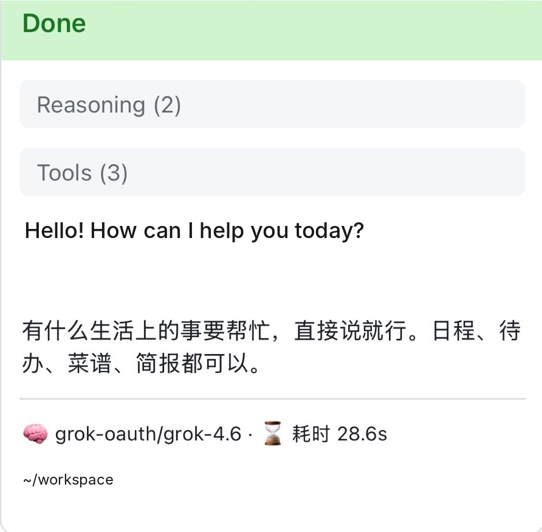

# cc-connect rich status card footer

A community patch for [chenhg5/cc-connect](https://github.com/chenhg5/cc-connect) that improves the **Feishu Card 2.0** (`card_mode = "rich"`) status footer on assistant replies.



> Screenshot placeholder: `docs/screenshot.png` will be added separately.

## What it looks like

With `card_mode = "rich"` and the patch applied, the card footer is a compact two-line summary (three lines if you enable the workspace directory):

1. **Turn summary** — model, reasoning effort, elapsed time  
   Example: `🧠 claude-opus-4-6 · 💪 Effort high · ⌛ Elapsed 7.5s`
2. **Context load** — used/window token counts, an eight-segment bar, and percentage  
   Example: `📝 Context 12.7k/121.6k · 🟩 ▫️ ▫️ ▫️ ▫️ ▫️ ▫️ ▫️ (10%)`
3. **Workspace** (optional) — shown only when `show_workdir_indicator = true`

The footer uses cc-connect’s existing i18n (`language` / auto-detect), so labels appear in English, Chinese, and other supported languages.

Quiet display modes still suppress live card updates, but the **final** rich card keeps real thinking and tool steps in its collapsed panel.

The patch also extends Codex rollout polling so context usage is read reliably before the final footer is built.

## Requirements

- A checkout of [cc-connect](https://github.com/chenhg5/cc-connect) at a release tag (tested against **v1.5.0**, commit `17c61062`)
- Go toolchain matching upstream `go.mod` (1.25+)
- Build tags: `goolm no_web` (same as a headless/agent-only build without the embedded web UI)

## Apply the patch

From the root of your cc-connect clone:

```bash
git fetch --tags
git checkout v1.5.0   # or your target tag
git apply --check richfooter.patch
git apply richfooter.patch
```

If `git apply` reports conflicts after upgrading to a newer upstream tag, use a three-way merge:

```bash
git apply --3way richfooter.patch
# resolve conflicts, then: git add -u && git commit
```

## Build

```bash
go test -tags "goolm no_web" -count=1 ./core/... ./agent/codex/ ./platform/feishu/
go build -trimpath -tags "goolm no_web" -o cc-connect ./cmd/cc-connect
```

To include the web UI, build the frontend (`make web`) and omit the `no_web` tag.

## Configuration

Set these under `[[projects]]` → `[display]` in `config.toml` (see upstream `config.example.toml`):

| Option | Purpose |
|--------|---------|
| `card_mode = "rich"` | Enable Feishu Card 2.0 rich cards (required for this footer). |
| `show_context_indicator` | When `true` (default), show the context line and progress bar on the footer. |
| `show_workdir_indicator` | When `true` (default), append the workspace directory as an extra footer line. Set `false` for a two-line footer. |

Global `language` (`en`, `zh`, etc.) controls footer strings via cc-connect i18n.

## Upgrading cc-connect

1. Check out the new upstream tag on your clone.
2. Re-apply `richfooter.patch` (`git apply` or `git apply --3way`).
3. Run tests and rebuild as above.
4. Replace your installed binary with the new build.

**Do not run `cc-connect update`** for a patched install: it replaces the binary with the stock release and removes this footer.

## License

MIT License, consistent with upstream cc-connect. See [LICENSE](LICENSE) and [NOTICE](NOTICE).

## Upstream

Please consider opening or following a pull request to [chenhg5/cc-connect](https://github.com/chenhg5/cc-connect) so this behavior can ship officially.
